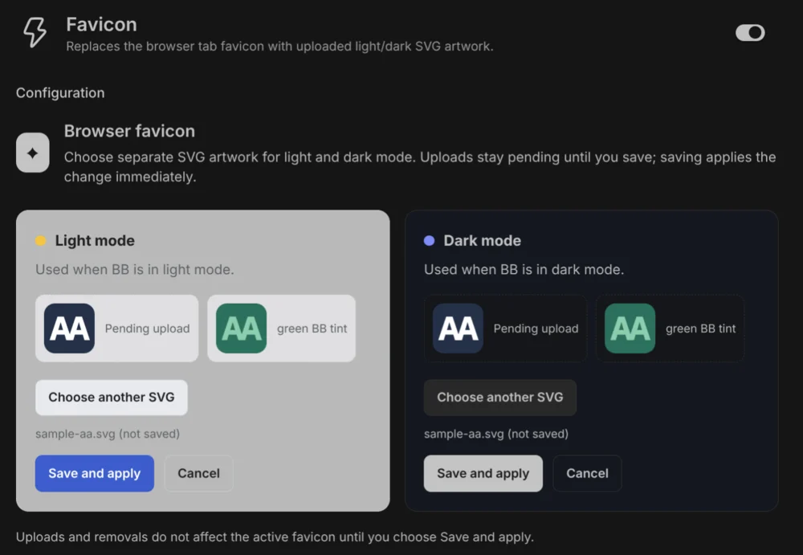

# Favicon

A BB plugin that replaces the browser tab favicon with your own light and dark SVG artwork.

## Install and configure

```sh
bb plugin install git:github.com/fgrehm/bb-plugins@main --subdirectory plugins/favicon
```

In BB Settings, open Favicon and choose an SVG for each theme. Uploads must be SVG files; URLs and file paths are not supported. The settings page previews the uploaded art and BB's 55%-opacity color tint. Choose **Save and apply** to activate an upload or removal; until then the current favicon stays in use. The tint preserves artwork shading and details, and the unread-badge dot is preserved.

For a screenshot without personal artwork, upload the original [AA sample favicon](docs/sample-aa.svg) for both themes. It is not installed automatically.

## Settings screenshot



The favicon is window-wide, not project-specific. The plugin restores the previous favicon when disabled or reloaded.
