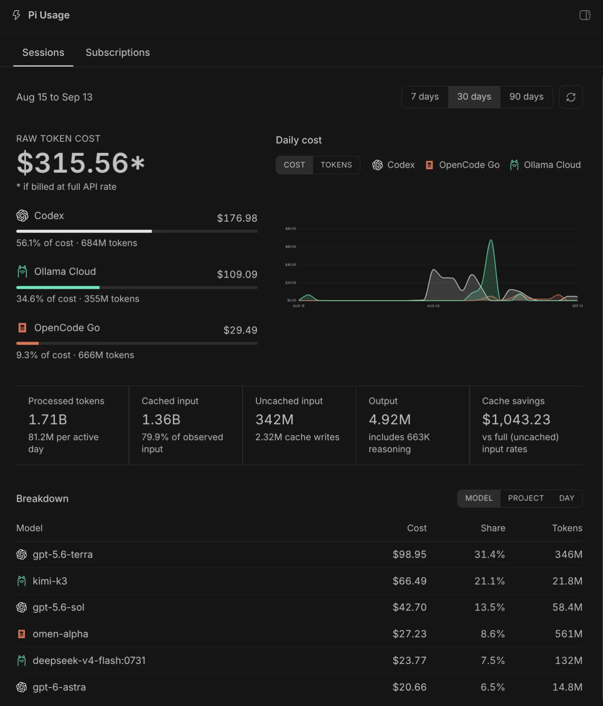
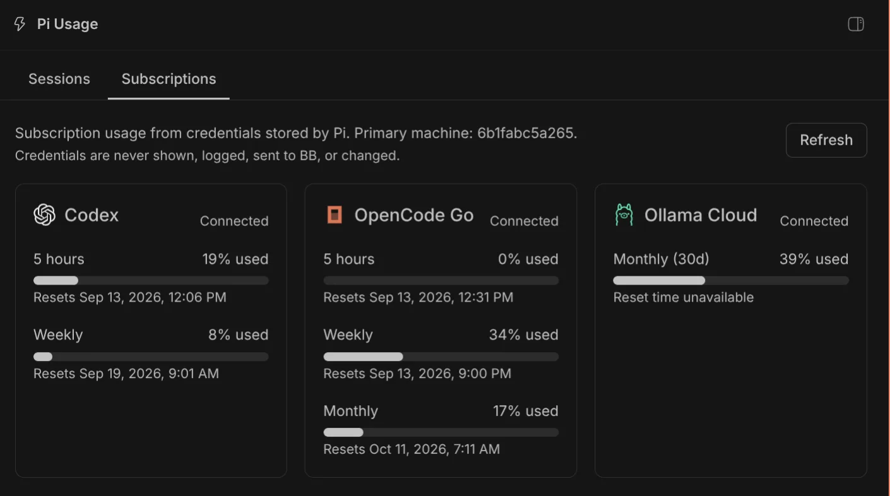
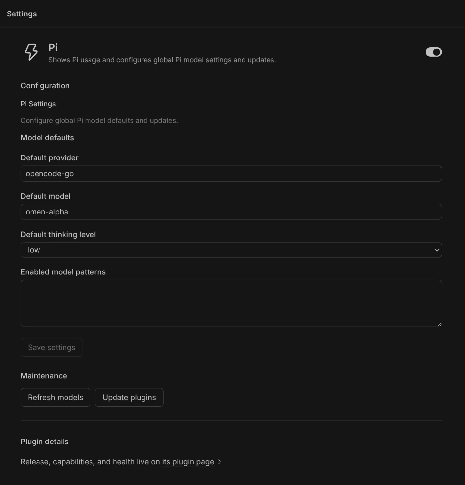

# Pi Usage

A local BB plugin that bundles Pi usage views into a single sidebar panel and adds global Pi configuration under BB Settings.

- **Sessions** - estimated token usage and cost computed from local Pi
  sessions (`~/.pi/agent/sessions` and `~/.bb/pi-bridge-sessions`), adapted
  from [iamEvanYT/bb-usage-page](https://github.com/iamEvanYT/bb-usage-page)
  (MIT), vendored under `usage-page/` and scoped to Pi only.
- **Subscriptions** - subscription usage for Pi-managed Codex, OpenCode Go,
  and Ollama Cloud credentials.

The plugin adds **Pi Usage** to BB's main sidebar and **Pi** to BB Settings. It is not an agent provider and does not appear in the provider or model pickers. See `THIRD_PARTY_NOTICES.md` at the repository root for full attribution.

## Screenshots

### Sessions



### Subscriptions



### Settings



## Subscriptions tab

The host worker reads Pi's `auth.json` from `$PI_CODING_AGENT_DIR/auth.json`,
or `~/.pi/agent/auth.json` when that variable is unset. It reads credentials
only and never logs, displays, refreshes, or modifies them.

Missing credentials are shown as "not configured", so the plugin remains
usable when only some providers are set up. An unreadable or malformed auth
file is reported as an error. Codex authentication failures are shown as
expired and should be refreshed through Pi.

The Codex and Ollama usage endpoints are undocumented and may change.

## Settings

The Settings entry manages global Pi defaults for provider, model, thinking level, and the model scope. It can also refresh model catalogs and update Pi extensions, with command output shown in the UI. The plugin preserves unrelated Pi settings and never reads or changes credentials.

### Available models

The default model is a searchable list of the models Pi actually offers, read from the Pi process on the primary machine (`get_available_models` over Pi's RPC mode, with extensions loaded so extension providers appear). The list is cached in the plugin for a minute and is invalidated when you refresh the model catalogs, because Pi itself only re-reads its catalog cache when asked.

The list covers providers with usable authentication, so a saved model can be missing from it because it was retired, because the catalog is stale, or because its provider is not signed in. The panel keeps such a value, marks it as not in the list, and never clears it for you; Pi falls back to one of its per-provider defaults at startup.

### Model scope and exclusions

Pi has no model exclusion setting. `enabledModels` is an allowlist of patterns used for the `Ctrl+P` cycle and for startup selection, and the only way to leave a model out is to leave it out of that allowlist. Patterns may be exact `provider/id` references, fuzzy id or name matches, or globs such as `openai-codex/*`, and they may carry a `:thinking` suffix.

Two consequences shape the panel:

- A `!` prefix is not an exclusion syntax. Pi matches globs without negation support, so `!openai-codex/*` inverts the match and can select nearly every model, while `!openai-codex/gpt-4` never matches anything. The panel flags such patterns instead of writing new ones.
- A non-empty scope overrides `defaultProvider` and `defaultModel` at startup, because Pi starts on the scope's first entry. The panel says so, and keeps the model you picked first in the scope.

The scope editor is driven by the same available-model list. It writes exact `provider/id` references, drops globs you have changed, keeps globs that still cover your selection, keeps patterns that match nothing (Pi warns and skips those, and a model may return), and omits `enabledModels` entirely when every available model is selected, which is how Pi stores "no scope".

## Development

```sh
pnpm install
pnpm test
pnpm run lint
bb plugin install . --yes
```

Tests use fake file reads and fake HTTP responses. They make no network calls
and never read your Pi credentials.
