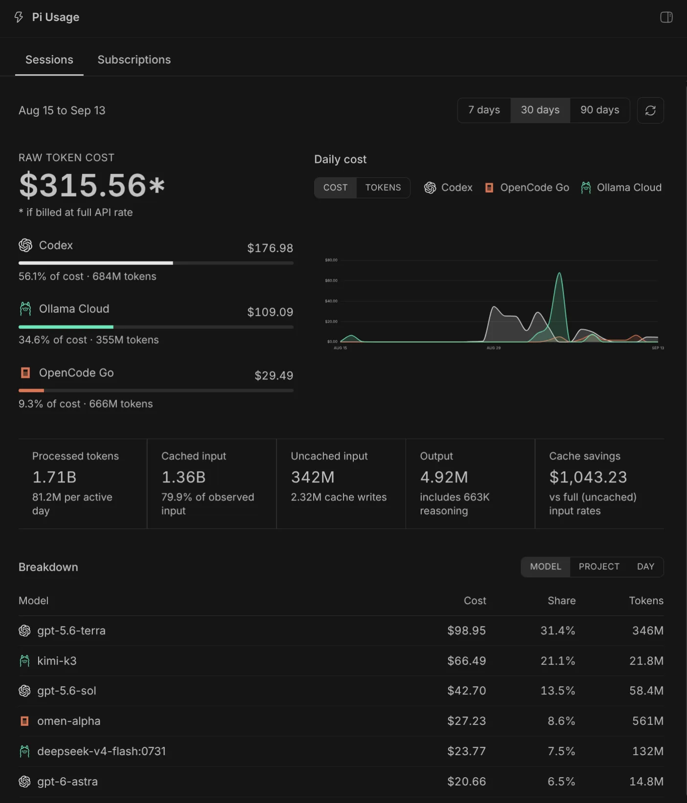
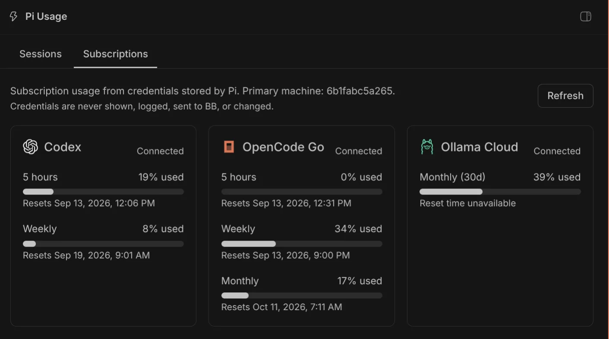
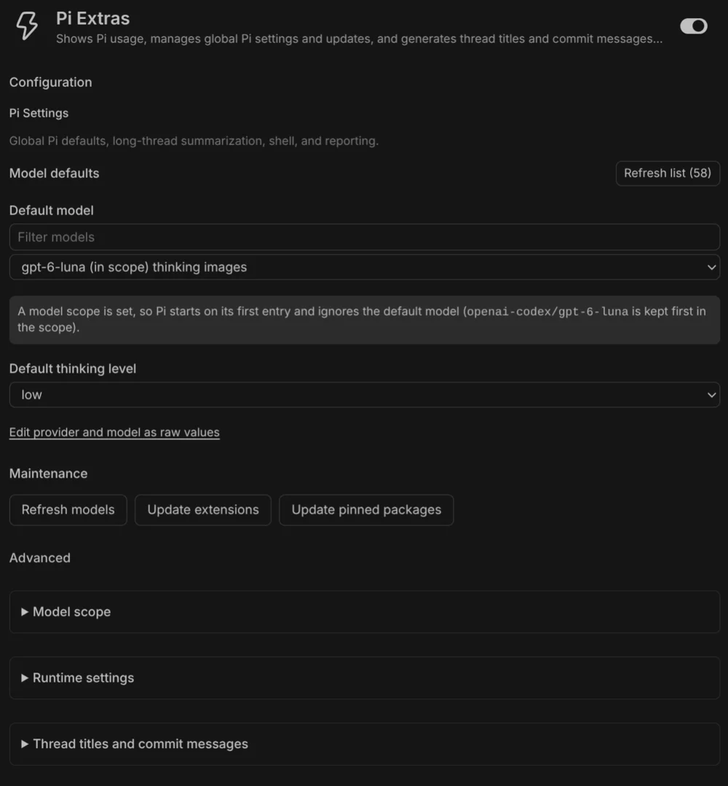

# Pi Usage

A local BB plugin that bundles Pi usage views into a single sidebar panel, adds global Pi configuration under BB Settings, and registers Pi as a BB AI service that names new threads.

- **Sessions** - estimated token usage and cost computed from local Pi
  sessions (`~/.pi/agent/sessions` and `~/.bb/pi-bridge-sessions`), adapted
  from [iamEvanYT/bb-usage-page](https://github.com/iamEvanYT/bb-usage-page)
  (MIT), vendored under `usage-page/` and scoped to Pi only.
- **Subscriptions** - subscription usage for Pi-managed Codex, OpenCode Go,
  and Ollama Cloud credentials.
- **Thread titles** - Pi answers BB's thread-titling prompt, so a new thread
  gets a short name instead of the first 80 columns of its own prompt.

The plugin adds **Pi Usage** to BB's main sidebar and **Pi** to BB Settings. It is not an agent provider and does not appear in the provider or model pickers. See `THIRD_PARTY_NOTICES.md` at the repository root for full attribution.

## Screenshots

### Sessions



### Subscriptions



### Settings



## Subscriptions tab

The host worker reads Pi's `auth.json` from `$PI_CODING_AGENT_DIR/auth.json`,
or `~/.pi/agent/auth.json` when that variable is unset. It reads credentials
only and never logs, displays, refreshes, or modifies them.

Missing credentials are shown as "not configured", so the plugin remains
usable when only some providers are set up. An unreadable or malformed auth
file is reported as an error. Codex authentication failures are shown as
expired and should be refreshed through Pi.

The Codex and Ollama usage endpoints are undocumented and may change.

## Settings

The Settings entry manages global Pi defaults for provider, model, thinking level, and the model scope. It can also refresh model catalogs and update Pi extensions, with command output shown in the UI. The plugin preserves unrelated Pi settings and never reads or changes credentials.

### Runtime settings

BB picks the model, reasoning level, instructions, and session directory itself when it starts a thread, and it does its own one-message-at-a-time queueing. So the settings that would steer a BB thread from Pi's side are few, and the panel edits only those: automatic summarization of long threads (on or off, the context held back for the reply, and how much recent conversation survives a summary), how long Pi waits on a silent provider, the shell Pi runs agent commands through plus an optional prefix for every command, and Pi's install and analytics reporting.

Most of Pi's global surface is deliberately absent because BB overrides it or because it cannot fire:

- `defaultProvider`, `defaultModel`, `defaultThinkingLevel`, and `enabledModels` are passed as launch arguments, so they only affect standalone `pi` runs.
- Message queueing is BB's own: a steer cancels the running turn and re-prompts one message at a time, so Pi's `steeringMode` and `followUpMode` never apply.
- Prompt-cache warming needs a model that declares a cache lifetime. None of the 57 models in the reference catalog do, so it cannot run.

Every control is tri-state. An empty choice removes the key from `settings.json` and hands the decision back to Pi, whose default is shown as a placeholder rather than written out. Round trips are non-destructive: keys the panel does not model, such as `compaction.modelOverrides`, and unrelated empty objects are left exactly as they were.

### Available models

The default model is a searchable list of the models Pi actually offers, read from the Pi process on the primary machine (`get_available_models` over Pi's RPC mode, with extensions loaded so extension providers appear). The list is cached in the plugin for a minute and is invalidated when you refresh the model catalogs, because Pi itself only re-reads its catalog cache when asked.

The list covers providers with usable authentication, so a saved model can be missing from it because it was retired, because the catalog is stale, or because its provider is not signed in. The panel keeps such a value, marks it as not in the list, and never clears it for you; Pi falls back to one of its per-provider defaults at startup.

### Model scope and exclusions

Pi has no model exclusion setting. `enabledModels` is an allowlist of patterns used for the `Ctrl+P` cycle and for startup selection, and the only way to leave a model out is to leave it out of that allowlist. Patterns may be exact `provider/id` references, fuzzy id or name matches, or globs such as `openai-codex/*`, and they may carry a `:thinking` suffix.

Two consequences shape the panel:

- A `!` prefix is not an exclusion syntax. Pi matches globs without negation support, so `!openai-codex/*` inverts the match and can select nearly every model, while `!openai-codex/gpt-4` never matches anything. The panel flags such patterns instead of writing new ones.
- A non-empty scope overrides `defaultProvider` and `defaultModel` at startup, because Pi starts on the scope's first entry. The panel says so, and keeps the model you picked first in the scope.

The scope editor is driven by the same available-model list. It writes exact `provider/id` references, drops globs you have changed, keeps globs that still cover your selection, keeps patterns that match nothing (Pi warns and skips those, and a model may return), and omits `enabledModels` entirely when every available model is selected, which is how Pi stores "no scope".

### Thread titles and commit messages

Select **Pi** independently for thread titles and commit messages under **BB Settings → AI services**. BB's Automatic choice does not select third-party plugins. If Pi is selected for commit messages, its generated subject is cleaned and limited to 72 columns; if generation fails or exceeds the time limit, BB uses its normal fallback.

The **Thread titles** section of Pi settings lets you choose available `provider/id` models for titles and commits, independently of BB's thread model and Pi's global defaults. The commit model defaults to the title model, but can be overridden because commit prompts include a diff and may take longer. An unset title model uses Pi's own default. The service runs on the primary BB machine, where Pi and its credentials must be available. BB creates and cleans both prompts; this plugin passes them to Pi.

## Design decisions

Checked against pi 0.87.1 and bb 0.44.0 on 2026-09-26. Nothing here is settled: each entry says what would change the answer. It is written down so that reopening any of these questions starts from the evidence rather than re-deriving it, and so the next reader can tell a deliberate decision from an oversight.

Prefer Pi's own documentation as the durable reference (`packages/coding-agent/docs/settings.md` and `packages/coding-agent/docs/security.md` in the [earendil-works/pi](https://github.com/earendil-works/pi) repository). The line-level references below into the Pi binary and the BB sources are evidence, not an API, and they drift.

### The model defaults configure Pi, not BB

BB launches Pi as a child process and passes the model and reasoning level as launch arguments, so the first four settings the panel edits never steer a BB thread. A live Pi process spawned by BB looks like this:

```sh
pi --mode rpc --session ~/.bb/pi-bridge-sessions/pi_<uuid>.jsonl \
   --session-dir ~/.bb/pi-bridge-sessions \
   --extension /tmp/bb-provider-bridge-provider-pi-*/pi/bb-pi-extension.mjs \
   --append-system-prompt /tmp/.../pi-append-*.md --skill <dir> \
   --model openai-codex/gpt-6-luna --thinking low
```

`defaultProvider`, `defaultModel`, `defaultThinkingLevel`, and `enabledModels` only affect standalone `pi` runs. They stay in the panel because that is a legitimate thing to want to configure from BB, not because they change how a BB thread behaves, and the panel says so where it matters. Reconsider if BB ever stops passing `--model` and `--thinking`.

One more thing the same argument list shows: BB always passes `--session-dir`, so Pi's own `sessionDir` setting cannot move where BB keeps its sessions.

### Helper model selection

Title and commit models are stored in `bb.storage.kv` rather than Pi's `settings.json`, because changing Pi's defaults would also affect standalone Pi runs. A commit model left unset falls back to the title model; an unset title model uses Pi's default. The BB `complete()` API provides no task identifier, so the plugin distinguishes the commit prompt from the title prompt by the commit template's `Shortstat:` and `Files (name-status):` sections. Revisit this if BB adds task-specific AI service declarations.

BB sends a rendered prompt containing instructions followed by `Task:` and the user's text. As one user message it produced a title about the instructions; separating the instructions into Pi's system prompt fixed that. The splitter uses the first `Task:` section marker, since the user's text can contain another. If BB changes this prompt format, the plugin sends the string unsplit. Reconsider if BB passes instructions and task separately.

Pi runs in print/JSON mode with `--no-tools --no-session --no-approve --no-context-files --no-skills --no-prompt-templates --thinking off`. BB has a five-second title budget; the plugin gives Pi four seconds. The shared process runner closes stdin immediately (print mode otherwise waits for EOF), bounds output, and kills the process on timeout or cancellation. The same runner handles Pi's model-list RPC.

Readiness asks Pi for available models with a short timeout, and caches only positive answers for thirty seconds. The settings panel and the AI service use the same check. A model may later become unavailable; BB's ordinary prompt-text fallback covers a failed completion.

### Exposed on purpose

| Setting | Why it is worth a control | Reconsider if |
|---|---|---|
| `compaction.enabled`, `reserveTokens`, `keepRecentTokens` | BB only compacts when asked, so Pi's own thresholds decide what happens once a thread gets long | BB grows a compaction policy of its own |
| `httpIdleTimeoutMs` | A big prompt on a slow reasoning model can sit silent for minutes; this is the most likely cause of a long turn dying | It stops being the cause of any observed failure |
| `shellPath`, `shellCommandPrefix` | Pi passes both straight into its `bash` tool definition at startup, and that tool runs every command in a BB thread | Pi stops building its tool definitions from settings |
| `enableInstallTelemetry`, `enableAnalytics` | The only privacy-relevant switches in the settings file, and a reader should be able to confirm their state | None; two switches are cheap |

### Not exposed

| Setting | Why not | Reconsider if |
|---|---|---|
| `steeringMode`, `followUpMode` | BB does its own queueing. A steer cancels the running turn via `session/cancel` and the bridge drains its queue one prompt at a time, so Pi's internal queue stays empty and the setting has nothing to decide. See `turn/steer` and the queue drain in `packages/provider-bridge-acp/src/bridge/bridge.ts` | BB switches to Pi's native steering instead of cancel-and-re-prompt |
| `cacheWarming` | It only runs for a model that declares a `promptCache` lifetime. None of the 57 models in the catalog did at the time of writing, so it could not fire | A model gains a `promptCache` entry after a catalog refresh, visible by re-querying `get_available_models` |
| `images.blockImages`, `images.autoResize` | Real, and `blockImages` is a genuine footgun: Pi replaces every image in a user message with the text "Image reading is disabled." before it reaches the model. Left out as settings the user does not attach images with. Note `autoResize` only reaches images the agent reads through Pi's own tools, not images attached to a prompt | Screenshots become a routine part of the workflow here |
| `defaultProjectTrust` | The most consequential key in the file, and deliberately left to Pi. See below | The user asks for a way to manage per-directory trust |
| `hideThinkingBlock` | BB renders Pi's reasoning behind its own `TimelineReasoning` component, so a Pi-side switch adds little | BB stops rendering reasoning blocks |
| `thinkingBudgets` | Reaches BB and works, but is per-level token ceilings that Pi already tunes per model. Left out as not worth the surface | Reasoning cost needs tuning per level |
| `retry.*` | Reaches BB. Left out because Pi's defaults are reasonable and it layers on top of whatever BB does with a failed turn, which was not verified and is a reason for caution | BB documents its own turn-level retry behavior, making the interaction predictable |
| `compaction.modelOverrides`, `retry.provider.*` | Per-model objects and provider-level retries. `compaction.modelOverrides` is preserved untouched on every write, and Pi's reference warns against provider retries | A specific override becomes necessary |

### Project trust, and why it stays in Pi

Pi documents the behavior directly: print, JSON, and RPC modes cannot show the built-in trust prompt, and with no command-line override, extension, or saved decision, `defaultProjectTrust: "always"` loads protected project resources while `"ask"` and `"never"` skip them.

In a BB setup every link in that chain is inert, which is why BB never prompts:

- BB passes neither `--approve` nor `--no-approve`.
- BB's Pi extension handles transport plumbing only; it never handles the `project_trust` event.
- `~/.pi/agent/trust.json` does not exist, and only Pi's `/trust` in its TUI writes one, which BB never runs.

So `ask` means "never" for BB threads and `always` means "every repository, every time", including project `packages` (which install npm packages) and `extensions` (which are executable code). The panel does not expose this, because a global switch that silently changes the trust boundary for every repo is not something to flip from a settings page, and because the per-directory answer, writing trust decisions, was not requested.

If that changes, the useful shape is not a select. It is a read-only list of which checkouts ship a `.pi` directory, plus per-directory decisions, which means this plugin writing to Pi's trust store and needs explicit sign-off first.

### Read-only and out of scope

- **The model list is read from Pi, not configured here.** The panel never writes `models.json` or the catalog, and never touches `auth.json` beyond the credential-free fields the Subscriptions tab reads.
- **Extensions and packages are not managed here.** They are read and updated through Pi's own commands by the existing maintenance actions. Extension-provided providers only appear in the model list because those extensions are loaded, which is why the list is read with extensions enabled.
- **TUI-only settings are out of scope by design**: theme, terminal, markdown rendering, fullscreen, editor, autocomplete, tree filters, `doubleEscapeAction`, `externalEditor`. They never affect a BB thread, and listing them would bury the settings that do.

## Development

```sh
pnpm install
pnpm test
pnpm run lint
bb plugin install . --yes
```

Tests use fake file reads and fake HTTP responses. They make no network calls
and never read your Pi credentials.
