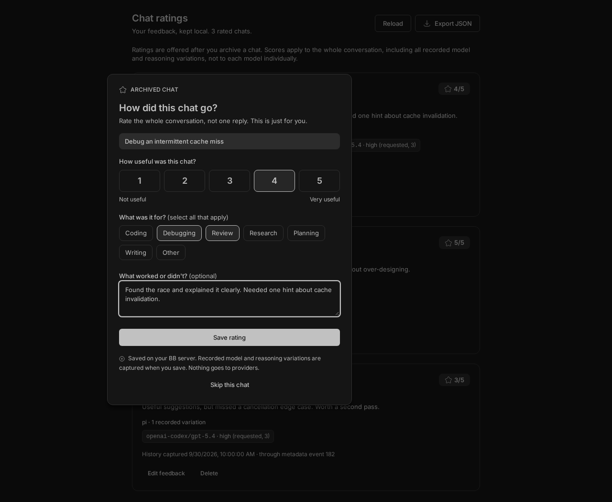
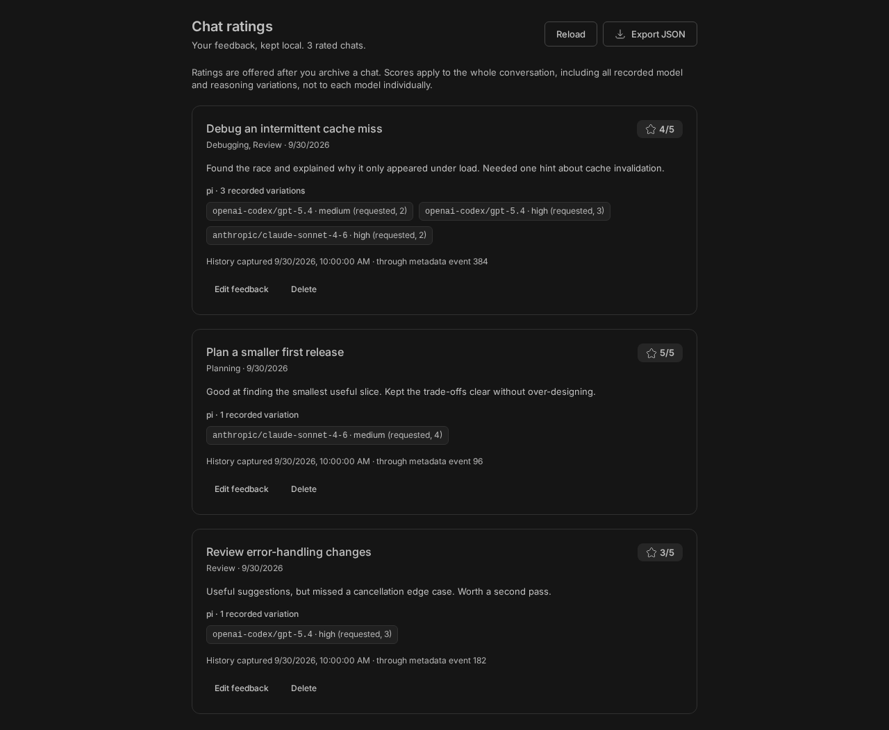

# Rate Your Chat

Local whole-chat feedback with recorded model and reasoning variations for later analysis.

This is an uncatalogued experiment for [BB](https://github.com/get-bb/bb). It never sends feedback to providers or asks a model to analyze it.

## Workflow

1. Archive a visible chat normally. Once the archive completes, a skippable rating dialog appears. There is no always-visible rating button, and archiving is never blocked by the plugin.
2. Choose usefulness from **1 (Not useful)** to **5 (Very useful)**, select one or more use cases (for example coding and review for a mixed chat), and optionally leave a note.
3. **Save rating** captures the chat's recorded model and reasoning variations and saves feedback locally. **Skip this chat**, Escape, or clicking outside dismisses this archive's prompt without storing a rating.
4. Open **Chat ratings** in the sidebar to review, edit, delete, or export saved feedback as JSON. Editing feedback preserves its captured history; archiving the chat again offers another prompt and saving updates that history.

There is one editable rating per chat, shared across BB clients. Ratings saved before multiple purposes were supported are read as a single-item use-case list and rewritten in the new shape when edited. Concurrent stale edits are refused instead of overwriting newer feedback, including after deletion and recreation. Failed saves retain the draft. Skipped prompts stay dismissed across reloads. Multiple archives, including cascade archives, are queued oldest first; hidden threads are ignored. Pending prompts survive plugin reloads. Before offering a prompt, the plugin checks current local thread metadata and removes obsolete prompts, including when an unarchive or delete event was missed while disabled. Reconciliation checks up to 20 queued prompts per request with a 10-second deadline; lookup failures retain prompts for retry. Archives made while the plugin is disabled or before installation are not backfilled.

## Screenshots

These captures use illustrative feedback in the live BB interface, not real user ratings.

### After archiving

A short, optional whole-chat rating, shown only after an archive.



### Review your feedback

Saved ratings show the use cases and recorded model/reasoning variations, with edit, delete, and export controls.



## What model history means

The plugin reads filtered, paginated **local BB event history** when you save. It records each dispatch's requested model and reasoning level, returns to earlier combinations, and provider-reported model fallbacks. Model identifiers are kept exactly as BB recorded them, including backend prefixes for Pi. Provider identity comes from the thread metadata.

The score belongs to the whole conversation. A mixed-model chat is not several independent ratings, and the plugin does not assign its score to each model. Variation counts are recorded observations, not guaranteed completed turns. Rejected dispatches are preserved in the export and SQLite observations but excluded from displayed variation counts. Companion lifecycle records are deduplicated when they repeat modern request metadata.

Capture reflects available evidence, not an assertion that every provider actually used every requested setting. Missing legacy metadata is flagged as partial, fallback reasoning is marked unknown, and no current defaults are substituted. BB does not record unused picker changes or all provider-internal routing. Child and source-thread histories are not folded into this chat's history. Capture stops at a fixed metadata sequence boundary; later turns require rearchiving and saving again.

Each save has a 30-second read deadline and captures up to 10,000 relevant events. Exceeding the event limit produces an explicit partial-history warning. Read failures do not replace existing feedback or its history. No transcripts are scanned from disk, and no background history collection runs.

## Storage and privacy

Uses BB's plugin-owned SQLite database at `<BB dataDir>/plugins/rate-your-chat/data.db`, on the **BB server**, not necessarily the device running your browser. The `ratings` table holds the feedback and captured history, and `observations` has SQL-queryable model/reasoning evidence. The `prompts` table tracks pending archive prompts, and `revision_clock` retains a counter to prevent stale writes after feedback deletion. The database is not encrypted by this plugin.

Feedback includes thread/project identifiers, a thread title snapshot, provider ID, archive/save times, usefulness, use cases, notes, and execution metadata. Filtered request events can contain prompt content in memory, but only execution metadata is extracted: prompt text, replies, tool output, credentials, and raw event payloads are never copied into the feedback database or export. Notes and titles may still be sensitive.

No feedback is added to chat messages, thread metadata, instructions, logs, agent tools, or bundled skills. No external service, telemetry, API key, or account is used. BB plugins and local agents are full-trust code; lack of an agent-facing tool is not an access-control boundary. All clients connected to the same BB server share this dataset.

Ratings survive thread archival and deletion until explicitly deleted in **Chat ratings**. Deletion removes the saved feedback and observations, not BB's original chat history. SQLite can retain deleted bytes in free pages or WAL files; this is not secure erasure. JSON export is an explicit browser download, includes all captured observations, and pages through saved records. Avoid concurrent edits during export if you need a consistent dataset. Uninstall/backup behavior is governed by BB's plugin storage lifecycle.

## Installation

Review the source before installing, BB plugins run with full trust. From a local checkout:

```sh
cd plugins/rate-your-chat
pnpm install
bb plugin build
bb plugin install . --yes
```

The plugin has no configuration settings, agent tools, CLI commands, or provider integration. Disable it in Installed plugins to stop new prompts. Existing ratings remain in local storage.

## Development

```sh
pnpm install
pnpm run typecheck
pnpm test
pnpm run format
bb plugin build
bb plugin dev
```

Tests cover archive-only prompting, local persistence, skips and reloads, stale-write protection, filtered history pagination, model/reasoning variations, fallbacks, missing metadata, and draft retention after errors. Vendored BB UI controls retain their [MIT license](components/LICENSE).
