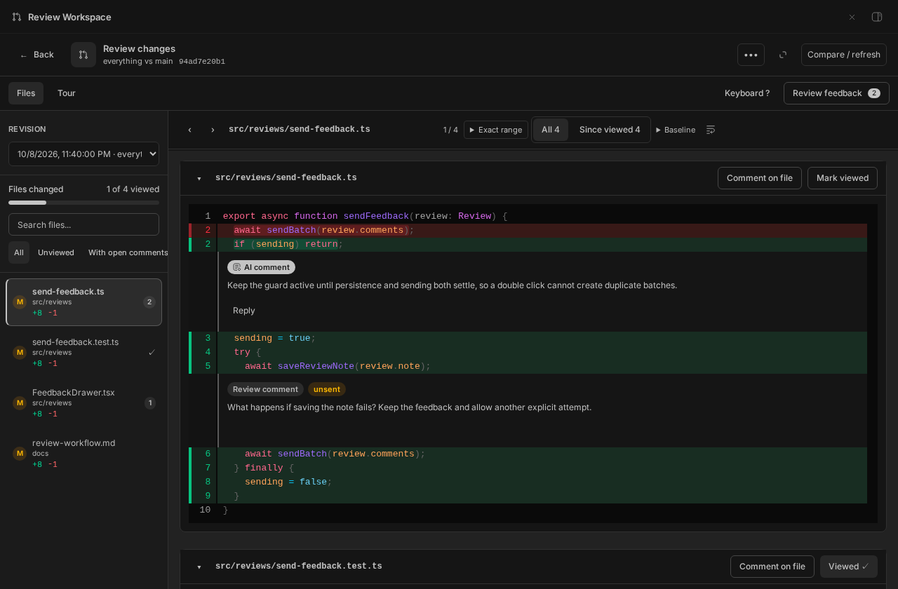
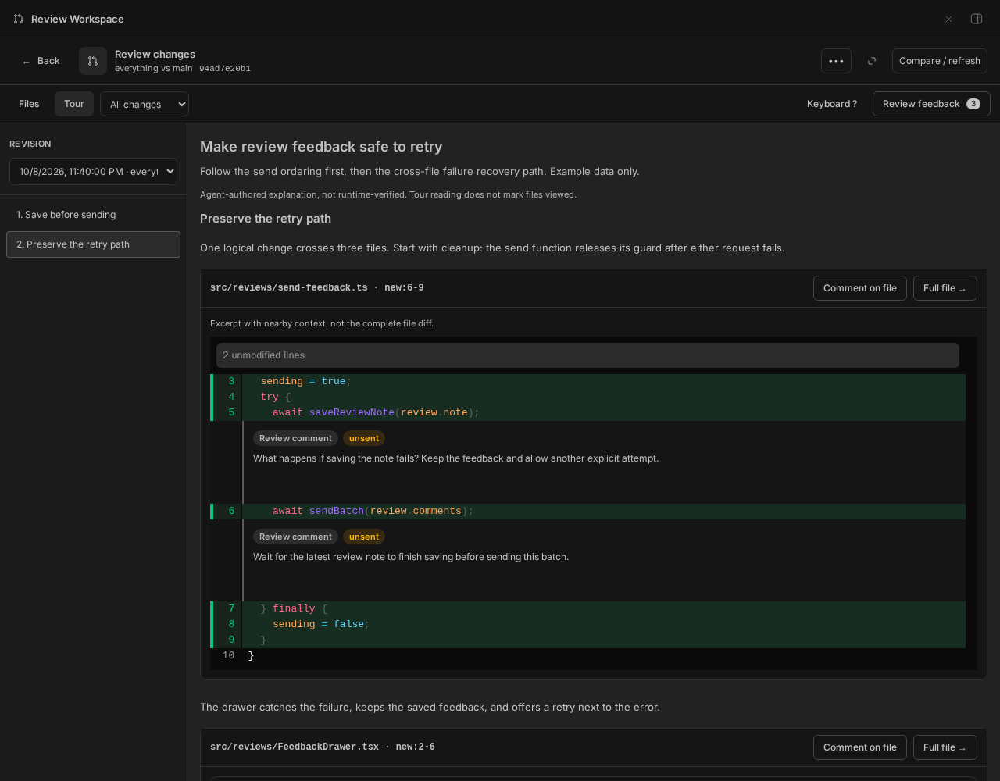
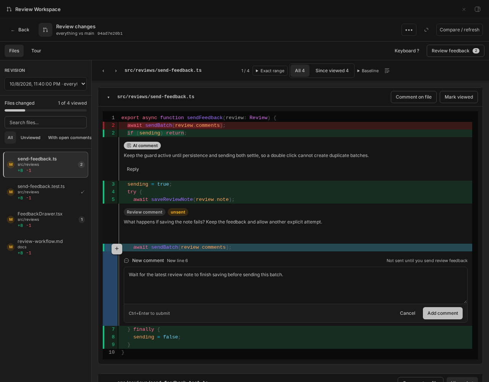
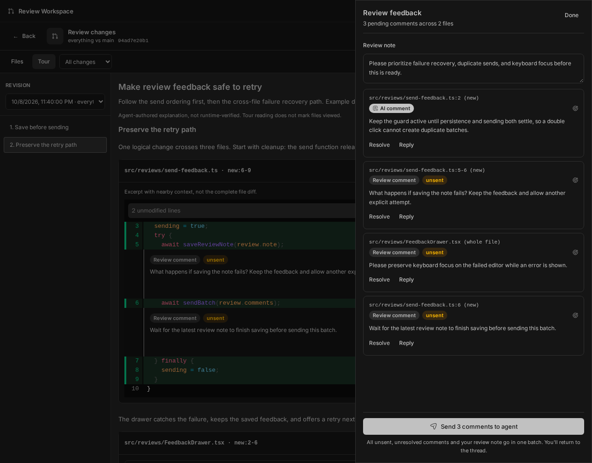
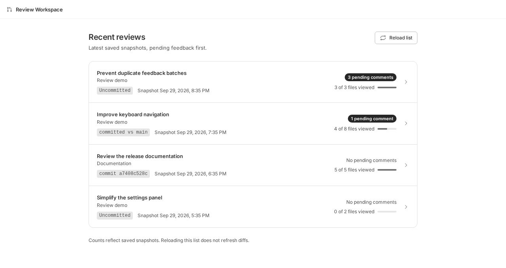

# Review Workspace

A BB plugin for asynchronous, diff-first reviews inside a thread.

Review Workspace captures Git changes from a thread's environment and offers two reading modes. **Files** shows the changes in one continuous document, with file navigation that jumps to each diff, inline and whole-file feedback, independent collapse controls, and explicit viewed state. **Tour** presents agent-authored explanation interleaved with exact code excerpts, with logical sections that can span multiple files. Both modes use the same revision-scoped comments. A focused Vim-style cursor supports keyboard-only review; exact line-range fields remain available for direct entry. Feedback goes to the agent in the owning BB thread only when requested; no separate review thread is spawned. File navigation shows filenames and parent directories, with complete paths in file headers.

The composer is a single freeform text box; comments render inline with the diff and are sent to the agent as-is in the batch, together with the diff hunks covering the commented lines (context included, capped in size). Each file can also have **file-level comments** anchored to the whole file (no line), shown in a card above its diff and threads/resolvable/sendable like any other comment; the batch panel has a **review note** for the changeset as a whole, sent with every batch. The agent can also add file-level comments via `review_workspace_comment` with `fileLevel: true`.

## Screenshots

These screenshots use synthetic example changes and feedback captured in the live BB interface. Every Review Workspace write was intercepted, so no review data was saved and no feedback was sent to an agent.

### Review changed files

Files is one continuous review document. Choose a saved revision, jump between changed files, and read whole-file and inline feedback next to the code.



### Read a cross-file tour

Switch to Tour to follow explanation and relevant code in logical order. Each excerpt links back to the full file; tour reading does not mark files viewed.



### Add anchored feedback

Select diff lines and write a comment. Line, range, and whole-file feedback all save to the review, not to the agent.



### Review and send

Check pending comments, replies, and the review note, then send them together in one batch.



### Resume saved reviews

The sidebar landing page lists the latest snapshot per thread, with pending comments first and viewed-file progress.



### Walkthrough

[Watch the earlier review walkthrough](assets/demos/session-rotation-review.webm) (WebM, 10.5 seconds). This historical capture uses the previous three-column layout. It does not represent the current Files/Tour layout, send feedback, or mark files viewed.

## Installation

Plugins are pre-release and not published to npm. Install this plugin from the repository:

```sh
bb plugin install git:github.com/fgrehm/bb-plugins@main --subdirectory plugins/review-workspace
```

For a local checkout:

```sh
bb plugin install path:/path/to/bb-plugins/plugins/review-workspace
```

BB plugins run with full trust. Review the source before installing. This plugin reads Git changes from thread environments, stores review data in its plugin database, reads BB thread metadata for discovery and cleanup, and sends feedback to the owning thread only when requested. It has no configuration settings.

## Review workflow

1. Open **Review** from a thread's header (the review icon on mobile).
2. Open **Compare / refresh** and pick **Uncommitted changes** (default), **Specific commit** (by sha), **Committed vs base**, or **Everything vs base** (including uncommitted work relative to an explicitly entered base branch such as `main`). Choose the target-specific button to save the first snapshot. Later, use **Refresh** or these controls to capture updated changes. Each snapshot is immutable and labeled with its captured target. Base branches are not inferred from the thread environment.
3. Select a revision and choose **Files** or **Tour**. Files renders every changed file in the current **All** / **Since viewed** scope in one scrollable document. File navigation jumps and focuses the relevant diff; search and **All**, **Unviewed**, and **With open comments** filters narrow navigation, not the document. Collapse and viewed state are independent. File counts show unresolved root threads, including inline and whole-file comments, with replies counted as part of their thread. On mobile, use the changed-file selector and filters. Since-viewed deltas use each path's latest explicitly marked viewed revision; navigation does not advance that baseline. Baseline details disclose source revisions, unknown comparisons, and paths reverted to the verified base.
4. Select lines in the diff gutter or focus the diff surface for keyboard review: `j` / `k` move lines, `h` / `l` switch old/new sides, `V` starts a same-side range, `c` opens an editor for the cursor line or selected range, `[` / `]` move between hunks, `,` / `.` change files, `m` explicitly toggles the current file's viewed state in Files mode, and `?` shows help. The **Exact range** controls accept any visible old/new multiline range. Navigation never marks a file viewed or sends feedback. Existing comments render inline with the diff. Reply to inline AI-authored comments directly from the diff; a reply to an AI reply is added to its existing root thread. New comment, reply, and edit boxes take focus when they open and submit with `Ctrl+Enter` (`Cmd+Enter` on macOS), with the button still available. Adding a comment saves it to the review, not to the agent; failed saves keep the draft and show an error beside the editor. File-level replies remain in the file comments card. Threads have one top-level comment with flat replies. Human comments can be edited or deleted until they are sent: **Edit** and **Delete** are hidden on AI-authored and sent comments, and **Delete** is disabled on a comment that has replies, which must be removed with their thread. Resolving a comment resolves its whole thread. Unresolved threads are carried to the next revision together. The locate button on any feedback comment jumps to its file and scrolls the comment into view.
5. Tour navigation selects a logical section in the main reading area, replacing the file tree with a table of contents rather than adding a separate rail. Sections interleave narrative, exact diff excerpts across files, and optional explanatory evidence. Excerpts show nearby context and only the code-scoped comments that overlap visible lines; whole-file feedback remains identifiable above the excerpt. **Full file** returns to Files and jumps to that file. Comments belong to code, never to a tour section. Invalid or unavailable anchors remain visible with reasons, and raw changes outside the tour are discoverable through coverage details and Files mode. Evidence is agent-authored, not runtime-verified. Tour reading never marks files viewed. Generated lockfiles, Rails schema files, and patches over 256 KiB defer patch loading until requested. Safe raster images use immutable old/new previews; unsupported binaries and truncated text keep explicit fallback states. Full Files diffs can expand unchanged context when complete immutable contents are available; tour excerpts cannot silently expand into unrelated code.
6. Use **Mark viewed** in each file header. Viewed state is separate from collapse state and stored separately for each immutable revision.
7. Open **Review feedback** to read your open comments and the review note. The button shows how many comments are pending. Resolved threads are folded into a **Resolved** list, and there is nothing to select: on mobile, use **Feedback** in the bottom navigation.
8. Choose **Send comments to agent**. All your unsent, unresolved comments go in one batch, and the agent also receives each thread's AI comment as context. Sending waits for the latest review note to be saved and returns you to the thread on success. If saving or sending fails, the drawer keeps your feedback and shows the error next to the send button so you can retry.
9. After the agent revises, refresh the review to create the next snapshot.

Each refresh creates an immutable review revision. Comments stay anchored to the revision and snapshot that produced them; they are never silently remapped onto a later diff. When a refresh produces a new snapshot, open feedback is **auto-carried** into it: unresolved comment threads (badged "carried", authorship and reply structure preserved) and the review note are copied to the new revision. Resolved comments and older revisions stay untouched. Earlier revisions remain available from the revision picker. Comments can be resolved or reopened explicitly.

The `review_workspace_tour` agent tool saves ordered sections containing narrative, diff, and evidence blocks, validated multi-file anchors, and raw-change coverage on one immutable revision. Tours are not carried to later revisions. The workspace sends anchored comments and the optional review note through the existing `sendBatch` contract. Review-level verdicts are not supported.

## Author a tour

Each step has an `id`, `title`, and ordered `blocks`. A `narrative` block contains `body`; a `diff` block contains one exact `anchor`; an `evidence` block contains an existing explanatory card shape (`call-graph`, `impact`, or `before-after`). Interleave explanation and excerpts in conceptual order, even when they cross file boundaries.

```json
{
  "title": "Preserve the retry path",
  "steps": [
    {
      "id": "retry",
      "title": "Recover after a failed send",
      "blocks": [
        { "kind": "narrative", "body": "Release the guard after failure." },
        {
          "kind": "diff",
          "anchor": {
            "filePath": "src/send.ts",
            "side": "new",
            "startLine": 7,
            "endLine": 9
          }
        },
        {
          "kind": "narrative",
          "body": "The drawer keeps feedback available for retry."
        },
        {
          "kind": "diff",
          "anchor": {
            "filePath": "src/Drawer.tsx",
            "side": "new",
            "startLine": 8,
            "endLine": 10
          }
        }
      ]
    }
  ]
}
```

A tour permits up to 50 uniquely identified steps. Each step permits up to 201 ordered blocks, 100 diff anchors, one evidence card, and 4000 narrative characters in total. Anchors are checked against the immutable snapshot; invalid anchors are reported, not dropped. The tool contract replaces the earlier per-step `body`, `anchors`, and `card` authoring fields. Existing snapshot files and comments remain readable, but older stored tours are not displayed; author a new block-based tour on that revision if needed. Agent tool definitions update on the next provider session start.

## Resume a review

Open **Review Workspace** in the sidebar for **Recent reviews**, a read-only list of the latest saved snapshot per thread across your projects. Each row shows the thread and project, snapshot target and time, unsent unresolved human-comment count (including replies), and viewed-file progress. Reviews with pending comments come first, newest snapshot first within each group. Review notes are not included in the pending-comment count.

Choose a row to open that thread's existing review. **Reload list** updates the list and counts; neither action refreshes Git diffs, creates snapshots, or sends feedback. The list loads when you open the page and on manual reload, without background polling. Failed reloads leave the previous rows visible with a retry action.

Discovery is limited to the 100 most recently snapshotted threads and shows up to 50 reviews. Hidden, archived, deleted, and missing threads are omitted. Older revisions remain available from each thread's revision picker, not as duplicate rows here. If the list is empty, open a thread's **Review** button, then choose **Open review** to save its first snapshot.

## Data retention

Reviews for an archived thread are eligible for automatic deletion after **7 days continuously archived**, measured from the thread's archive time, not the age of its snapshots. This also applies to reviews that existed before cleanup was enabled. Unarchiving during the grace period preserves the review data; archiving again starts a new grace period. Active threads are not aged out.

Purging removes all of that thread's review revisions, saved file contents and patches, immutable image assets, tours, comments (including unsent feedback), review and file notes, resolution suggestions, and viewed state. **Deletion is irreversible**, unarchiving afterward does not restore reviews. Comments already imported into another thread are independent copies and remain there. Deleting a BB thread triggers immediate cleanup of its reviews; missed deletions and genuinely missing threads are reconciled by the background sweep.

BB runs a one-time cleanup service after plugin load, and its built-in background scheduler runs the hourly job while the plugin is enabled; no system cron or agent thread is involved. Each pass checks up to 100 saved review owners with a 60-second time budget and a persisted cursor, so large histories can take multiple passes. Thread metadata lookup failures retain data for a later retry. Cleanup does not scan Git, modify BB threads, or send feedback. Freed database pages are reused; cleanup does not force the database file to shrink.

## Development

```sh
pnpm install
pnpm run typecheck
pnpm test
pnpm run coverage
bb plugin dev   # rebuild + hot-reload on every save

# for release/install:
bb plugin build
bb plugin install . --yes
bb plugin reload review-workspace
```

`@pierre/diffs` is supplied by BB's plugin runtime. See [`KNOWN_ISSUES.md`](KNOWN_ISSUES.md) for the current BB host worker-theme limitation.

Files mode renders one continuous document, so changed files are mounted lazily: a diff is parsed and rendered only once it nears the viewport, and stays mounted afterwards. Draft comments are held in the panel rather than in each file, so typing never re-renders unrelated diffs. Keep both properties when changing the reading modes; large mobile reviews degrade badly without them. A probe that measures mount count, long tasks, and typing latency against a synthetic 16-file review lives at `.agents/scratchpad/review-workspace-layout/perf-probe.mjs` in the maintainer's checkout.

## Agent tools

The plugin registers agent tools. They are always registered and become available to threads from the next provider session start; a plugin can narrow its own selection per session via `bb.agents.configure`, which this plugin does not do:

- `review_workspace_refresh` - create a new review revision snapshot: uncommitted changes by default, a single commit by sha, or committed branch changes relative to a merge-base branch. Agents call this to prepare a review session (including on already committed code) before a human opens Review changes.
- `review_workspace_tour` - author or replace ordered sections of `narrative`, `diff`, and `evidence` blocks on one immutable revision, with exact multi-file anchors, validation, and raw changed-line coverage.
- `review_workspace_status` - changed files and unresolved comments (line-anchored and file-level) for the latest revision.
- `review_workspace_comment` - add a line-anchored comment to the latest revision.
- `review_workspace_resolve` - resolve or reopen a comment by id (e.g. after applying the feedback).
- `review_workspace_history` - list recent review revisions from other threads in the same project, marking those that share the calling thread's environment/checkout. Reviews stay thread-scoped; this is the discovery step for pulling in prior feedback.
- `review_workspace_import` - copy unresolved comments from a listed revision (same project only) into the calling thread's latest revision, keeping comment threads intact via id remapping. Call `review_workspace_refresh` first so imported comments anchor to a diff.
- `review_workspace_clear` - permanently delete reviews for the calling thread, or all stored reviews across threads and projects. This removes snapshots, comments, notes, and viewed state.
